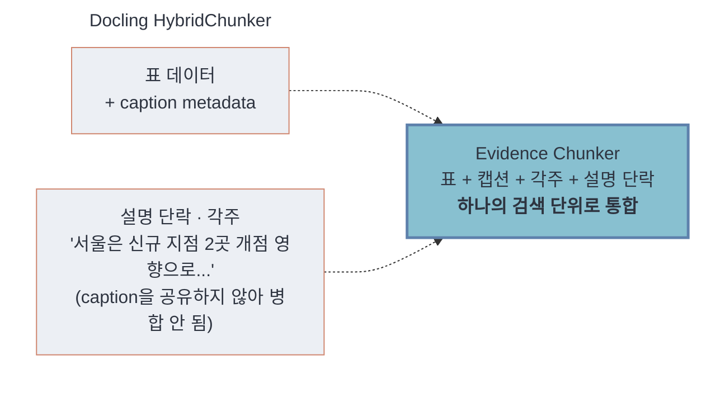

<div align="center">

# Evidence Chunker

**표가 포함된 PDF에서 RAG가 정답을 놓치지 않도록**

Docling이 파싱한 PDF의 표·캡션·설명 단락을 하나의 검색 단위(Evidence Unit)로 구성해 RAG 검색 성능을 높이는 Python 라이브러리

[](LICENSE)
[](pyproject.toml)

</div>

## 목차

- [문제 정의](#문제-정의)
- [핵심 아이디어](#핵심-아이디어)
- [주요 기능](#주요-기능)
- [아키텍처](#아키텍처)
- [설치](#설치)
- [사용 방법](#사용-방법)
- [성능](#성능)
- [설정](#설정)
- [한계 및 로드맵](#한계-및-로드맵)
- [라이선스](#라이선스)
- [Wiki](#wiki)

---

## 문제 정의

RAG 파이프라인에서 표가 포함된 PDF는 정답률이 유독 낮다. 많은 경우 원인은 파싱 자체보다 검색 단위(chunking) 구성 방식에 있다.

즉, 문제는 PDF parsing 이후 retrieval을 위해 문서 요소를 어떻게 재구성하느냐에 있다.

Docling은 표 구조와 캡션 정보를 보존하고 메타데이터로 연결해준다(`table.captions`, `HybridChunker`의 `merge_peers`/`repeat_table_header`). 문제는 HybridChunker의 merge 규칙이 동일한 heading/caption 정보를 공유하는 요소 중심으로 동작한다는 점이다. 

표를 해석하는 데 필요한 본문 설명 문단은 그 표의 caption을 공유하지 않으므로 병합 대상에서 빠지고, 표와 별도 청크로 남는다.



그 결과, 표 숫자와 설명 단락이 함께 있어야 풀리는 질문이 들어오면 하나의 청크만으로는 답을 구성할 수 없다.

이에, **Evidence Chunker는 같은 표의 캡션+숫자+각주+설명 문단을 한 청크(EU)로 묶어 반환한다.** Docling의 강력한 기능(파싱, 레이아웃 분석, 캡션-표 연결)은 그대로 사용하되, Docling이 다루지 않는 계층(설명 문단을 표와 같은 검색 단위로 묶는 것)을 그 위에 추가한다.

### Evidence Unit (EU)

현재 구현에서는 표를 중심으로 다음 요소를 하나의 Evidence Unit으로 구성한다.

- 표 데이터(table)
- 캡션(caption)
- 각주(footnote)
- 표 주변의 인접 설명 단락(context paragraphs)

Evidence Chunker는 이 평가셋(`context_dependent`, 536문항)에서 baseline 대비 정답을 188개까지 끌어올린다(EM 35.1%, +34.2pp). 자세한 유형별·대조군 수치는 [Benchmark](https://github.com/EvidenceChunker/Evidence-Chunker/wiki/Benchmark) 참고.

---

## 핵심 아이디어

> "Evidence Unit"이라는 용어와 "파싱 요소를 개별 청크가 아닌 의미적으로 완결된 단위로 묶는다"는 상위 아이디어는 [Han (2026), *Evidence Units: Ontology-Grounded Document Organization for Parser-Independent Retrieval*](https://arxiv.org/abs/2604.00500)에서 가져왔다. 논문의 파이프라인 전체를 구현한 것이 아니라, 그 상위 개념을 Docling 한 파서에 한정하고 간단하게 재구성하였다.
  
Docling의 `DoclingDocument`를 입력받아, 이미 연결된 `captions` 참조와 `prov[0].bbox`를 활용해 표를 중심으로 Evidence Unit을 구성한다.

1. **캡션↔표 연결**: `captions` 참조 우선, 실패하면 bbox 거리 → 인접 페이지 → 병합 헤더 순으로 fallback
2. **인접 설명 단락 부착**: bbox 거리 기준으로 표 위/아래 단락을 EU에 포함
3. **큰 표 분할**: 토큰 한도(기본 512)를 넘는 표는 헤더+캡션을 반복 삽입하며 행 단위로 분할

---

## 주요 기능

| 기능 | 설명 |
| --- | --- |
| 캡션↔표 자동 연결 | 4단계 fallback(direct → bbox → 인접 페이지 → 병합 헤더)으로, 캡션 정보가 부족한 표까지 연결 시도 |
| 인접 문맥 자동 부착 | bbox 거리 기반으로 표 위/아래 설명 단락을 탐지해 EU에 포함 |
| 큰 표 자동 분할 | 512토큰 초과 시 헤더+캡션을 반복 삽입하며 행 단위 분할, 모든 조각에 문맥 정보 동일 전파 |
| LangChain / LlamaIndex 래퍼 | `to_langchain()`, `to_langchain_units()`(small-to-big), `EvidenceRetriever`(max-pool dedupe 내장) |
| 가벼운 기본 의존성 | 기본 설정(`sim_threshold=0.0`)에서는 `sentence-transformers` 없이도 동작 |

---

## 아키텍처

```mermaid
flowchart LR
    PDF([PDF]) --> Docling[Docling]
    Docling --> Parser[Parser]
    Parser --> Chunker["EvidenceChunker"]
    Chunker --> Split[Split]
    Split --> Export[Export]
    Export --> RAG([RAG])

    %% GitHub 호환용 Nord Deep 스타일 지정
    style PDF fill:#EBCB8B,stroke:#D08770,stroke-width:1.5px,color:#2E3440
    style Docling fill:#E5E9F0,stroke:#8FBCBB,stroke-width:1.5px,color:#3B4252
    style Parser fill:#D8DEE9,stroke:#4C566A,stroke-width:1.5px,color:#2E3440
    style Chunker fill:#88C0D0,stroke:#5E81AC,stroke-width:2.5px,color:#2E3440
    style Split fill:#A3BE8C,stroke:#4C566A,stroke-width:1.5px,color:#2E3440
    style Export fill:#B48EAD,stroke:#4C566A,stroke-width:1.5px,color:#2E3440
    style RAG fill:#EBCB8B,stroke:#D08770,stroke-width:1.5px,color:#2E3440

```



모듈별 역할과 데이터 흐름은 [Architecture 문서](https://github.com/EvidenceChunker/Evidence-Chunker/wiki/Architecture)에서 더 자세히 볼 수 있다.

---

## 지원 범위

현재 지원:

- PDF (Docling parser 기반)

입력은 Docling이 파싱 가능한 PDF. 표 구조 인식은 Docling의 `do_table_structure`에 의존하므로, OCR 품질이 낮거나 표 구조가 복잡한 PDF는 상위 파이프라인(Docling)의 한계를 그대로 이어받는다.

---

## 설치

```bash
git clone https://github.com/EvidenceChunker/Evidence-Chunker
cd Evidence-Chunker
pip install -e ".[langchain]"
```

| extra | 설치 명령 | 필요할 때 |
| --- | --- | --- |
| `langchain` | `pip install -e ".[langchain]"` | LangChain 연동 |
| `llamaindex` | `pip install -e ".[llamaindex]"` | LlamaIndex 연동 |
| `similarity` | `pip install -e ".[similarity]"` | `sim_threshold > 0`으로 코사인 필터 사용 시 |

---

## 사용 방법

**Evidence Unit 생성**

```python
from evidence_chunker import EvidenceChunker

chunker = EvidenceChunker()
eus = chunker.chunk("paper.pdf")
# List[EvidenceUnit]
# 각 EU는 표 + 캡션 + 각주 + 인접 문맥을 포함하는 검색 단위
# 일반 본문까지 포함한 전체 코퍼스는 build_corpus() 사용

for eu in eus:
    print(eu.caption_text, "->", len(eu.text), "chars")
```

**LangChain 벡터스토어에 연결**

```python
from evidence_chunker.export.langchain import EvidenceRetriever
from langchain_core.documents import Document
from langchain_core.vectorstores import InMemoryVectorStore
from langchain_huggingface import HuggingFaceEmbeddings

# retrieval_text(캡션+문맥+표 문장, table_html 제외)로 임베딩
docs = [Document(page_content=eu.retrieval_text, metadata=eu.metadata) for eu in eus]

vectorstore = InMemoryVectorStore.from_documents(docs, HuggingFaceEmbeddings(model_name="all-MiniLM-L6-v2"))
retriever = EvidenceRetriever(vectorstore, k=5)  # max-pool dedupe 기본 적용
```

> `export.langchain.to_langchain()`을 쓰면 편의상 `page_content=eu.text`(HTML 포함)가 기본값으로 들어간다. 검색 정확도를 최대화하려면 위 예제처럼 `eu.retrieval_text`를 직접 쓰는 걸 권장. 자세한 이유는 [API Reference](https://github.com/EvidenceChunker/Evidence-Chunker/wiki/API-Reference) 참고.

**표+본문을 합친 전체 코퍼스가 필요한 경우**

```python
chunks = chunker.build_corpus("paper.pdf")  # EU(표) + TextChunk(일반 본문)
```

더 많은 예제는 [API Reference](https://github.com/EvidenceChunker/Evidence-Chunker/wiki/API-Reference) 참고.

---

## 성능

90개 PDF, 2725문항 기준 (baseline: Docling HybridChunker 단독):

| 지표 | baseline | Evidence Chunker | 갭 |
| --- | --- | --- | --- |
| Recall | 0.574 | 0.625 | +5.1pp |
| EM | 0.314 | 0.569 | +25.5pp (95% CI ±1.88pp) |

`context_dependent`(표+설명 문단이 결합돼야만 풀리는 질문 유형)는 baseline에서 매우 낮은 성능(EM 0.009)을 보였으나, 동일 평가 조건에서 Evidence Chunker는 EM 0.351까지 향상했다(+34.1pp).

유형별 성능 및 대조군(청크 크기 확대·행분할·semantic chunker) 비교 등은 [Benchmark](https://github.com/EvidenceChunker/Evidence-Chunker/wiki/Benchmark), 파라미터 스윕(bbox/sim_threshold) 등 전체 실험 과정은 [Experiments](https://github.com/EvidenceChunker/Evidence-Chunker/wiki/Experiments) 참고.

---

## 설정

| 파라미터 | 기본값 | 설명 |
| --- | --- | --- |
| `bbox_threshold` | `300.0` (pt) | 표 위/아래 설명 단락을 수집할 거리 범위. 100~1000pt 스윕으로 검증 |
| `sim_threshold` | `0.0` | 문맥 단락 채택 코사인 유사도 임계값. 0.0이면 임베딩 모델을 아예 로드하지 않음(의존성 절약) |

```python
chunker = EvidenceChunker(bbox_threshold=300.0, sim_threshold=0.0)  # 기본값
```

자세한 근거와 스윕 실험 결과는 [Configuration](https://github.com/EvidenceChunker/Evidence-Chunker/wiki/Configuration) 참고.

---

## 한계 및 로드맵

- Recall@10이 max-pool dedupe에도 불구하고 baseline 대비 근소하게 낮음
  - 분할 조각 간 dedup 미적용이 원인
- 문서 내 구조적으로 유사한 표가 여러 개 있을 때 검색 단계에서 혼동 발생
- `bbox_threshold` 파라미터를 적응형 임계값으로 확장 검토

전체 목록과 각 항목의 원인 및 실측 근거, 진행 상황은 GitHub Issues에서 공개 추적한다.

---

## 라이선스

Apache License 2.0.

---

## Wiki

더 자세한 문서는 [Wiki Home](https://github.com/EvidenceChunker/Evidence-Chunker/wiki/Home)에서 볼 수 있다.

| 문서 | 이런 게 궁금할 때 |
| --- | --- |
| [Architecture](https://github.com/EvidenceChunker/Evidence-Chunker/wiki/Architecture) | 파이프라인 동작 순서, 모듈별 책임 |
| [API Reference](https://github.com/EvidenceChunker/Evidence-Chunker/wiki/API-Reference) | `EvidenceChunker`, `EvidenceUnit`, export 함수 시그니처 |
| [Configuration](https://github.com/EvidenceChunker/Evidence-Chunker/wiki/Configuration) | 파라미터 기본값 설정 근거 |
| [Benchmark](https://github.com/EvidenceChunker/Evidence-Chunker/wiki/Benchmark) | baseline 대비 최종 결과 |
| [Experiments](https://github.com/EvidenceChunker/Evidence-Chunker/wiki/Experiments) | 최종 결과에 이르기까지의 전체 실험 로그 |
| [QA Generation](https://github.com/EvidenceChunker/Evidence-Chunker/wiki/QA-Generation) | QA 자동생성기 설계 |
| [Examples](https://github.com/EvidenceChunker/Evidence-Chunker/wiki/Examples) | README보다 더 긴 실전 예제, 커스텀 설정·엣지케이스 처리 |

